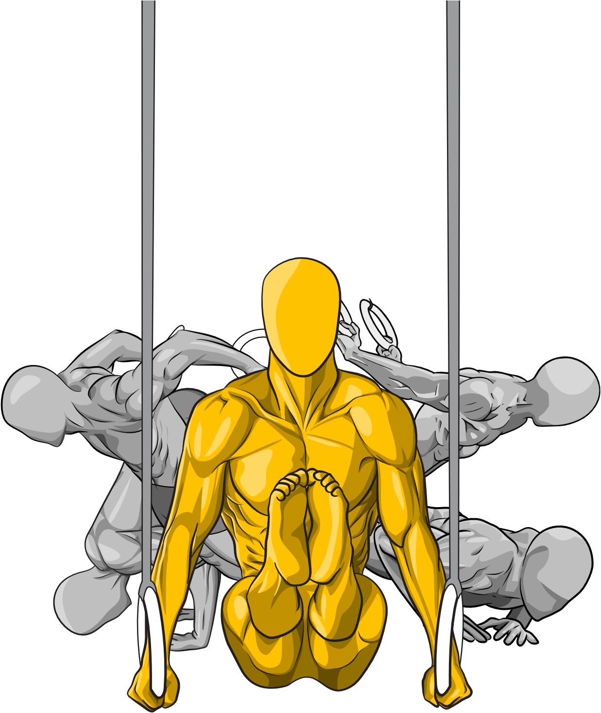
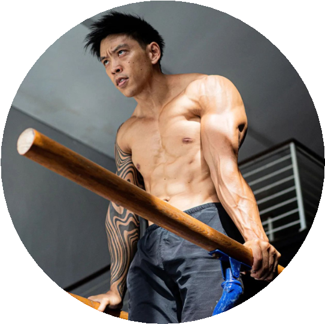
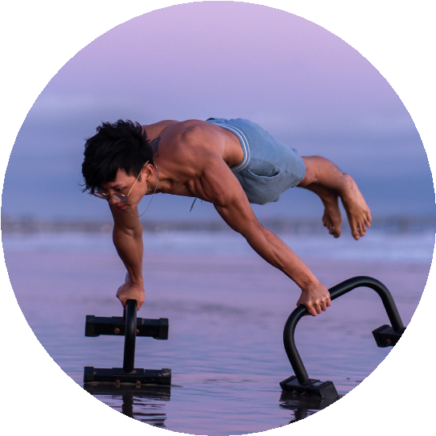
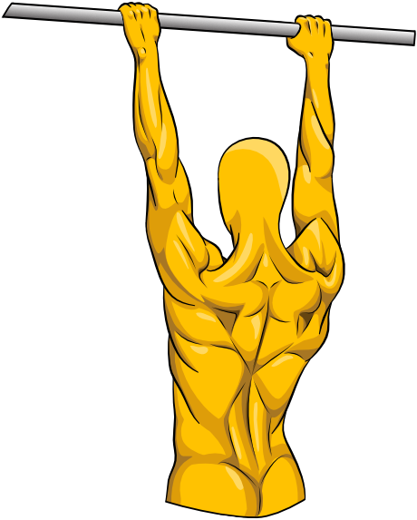
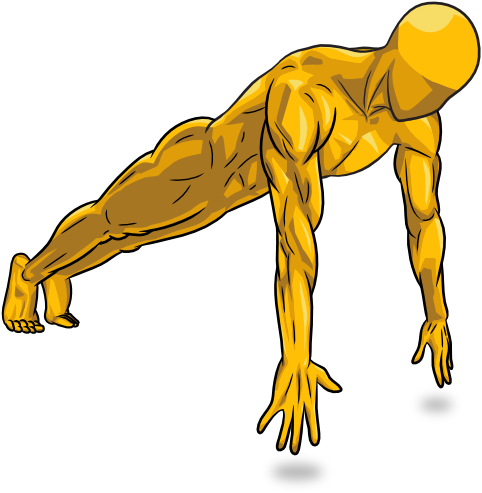
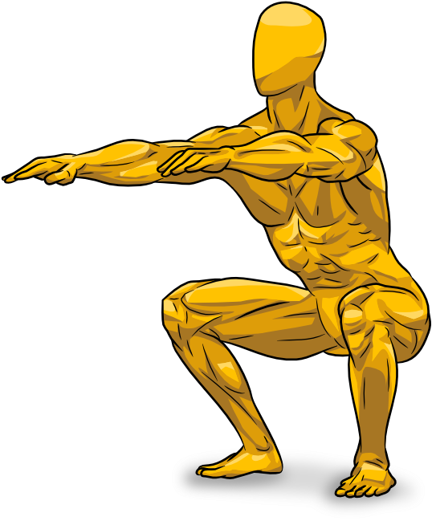

> CALISTHENICSPLAYBOOK Learn Bodyweight Fitness Visually

FOREWORD

> Looking back at the earliest days of
> [<u>Gravgear</u>](https://thegravgear.com/), I realized our approach
> was flawed. Posting product images on Instagram felt intrusive, almost
> like spam. It went against my central belief: to offer value before
> asking for anything in return.
>
> Growing up, I found two passions that ignited my spirit - calisthenics
> and drawing. The former unlocked the impressive capabilities of our
> bodies, and the latter brought my creative ideas to life. Suddenly, it
> hit me: why not blend these passions?
>
> Thus, Yellow Dude was born - a fusion of fitness insights and playful
> sketches. The response was astounding. The content resonated so
> strongly that I devoted myself to creating these pieces for two years,
> rarely mentioning Gravgear. Yellow Dude didn't generate revenue, but
> it brought immeasurable joy.
>
> The affection that Yellow Dude received indicated it was time for him
> to evolve into his own brand. This book marks that transformation. It
> is a curated compilation of our shared social media content, enhanced
> with refined illustrations and valuable insights from experienced
> coaches, offering a guide that is both enjoyable and actionable.
>
> July, 2023
>
> Author Wayne Foong

CONTRIBUTOR CREDITS

>  style="width:1.81032in;height:1.80745in" />Meet William Soo
> ([<u>@wsoo_mvmt</u>](https://www.instagram.com/wsoo_mvmt/)), a fitness
> coach with over 17 years’ experience in calisthenics, mobility,
> handstands, and strength and conditioning. Starting off as a
> bodybuilder, William transitioned to calisthenics, sacrificing 7kg of
> muscle for improved bodily freedom. Nowadays, William displays an
> emphasis on exploration, focusing on gaining more ranges of motion to
> push the limits of the body and mind. Throughout his journey of
> setbacks and success, William uses his experience to guide others
> achieve their goals by providing simple, realistic, and
> thought-provoking advice.
>
> Marcus
> Wong <u>([@mrwong_sw](https://www.instagram.com/mrwong_sw/)</u>) is a
> seasoned calisthenics athlete and coach. He has honed his skills for
> over five years and has a knack for the challenging Planche movement.
> Marcus found calisthenics at 15, a gym-less fitness enthusiast looking
> for a way to work out. Despite hurdles and injuries, he persisted and
> mastered the basics, then advanced skills like handstands and planche.
> Today, Marcus leverages his hard-earned insights to guide others on
> their fitness journey. He underscores safe and eficient training,
> helping others avoid the pitfalls he encountered. He sees his role as
> a coach as a way to share knowledge, which he views as the most
> rewarding part of his journey.

COPYRIGHT

> **Copyright** **©** **2023** **by** **Gravgear** **Pte.** **Ltd.**
>
> All rights reserved. This digital copy is licensed for personal use
> only to the purchaser. Each digital copy has been uniquely stamped
> with the purchaser's identity. Redistribution, reselling, or any form
> of reproduction or transmission, in whole or in part, in any format or
> by any means, electronic or mechanical, is prohibited without prior
> written permission from the publisher, except for brief quotations in
> noncommercial reviews or articles.
>
> Unauthorized use, sharing, or reproduction of this copyrighted work is
> illegal and an infringement of the author's rights. Legal action will
> be taken against any infringement.
>
> Published by Gravgear Pte. Ltd.
>
> First Digital Edition, July 2023
>
> ISBN: 978-981-18-7909-8
>
> Website: [<u>thegravgear.com</u>](https://thegravgear.com/),
> [<u>yellowdude.co</u>](https://yellowdude.co/)

DISCLOSURE

> This content is here to help you make progress in your health and
> fitness journey. But remember, it's a general guide. We've based the
> advice on personal experiences, government guidelines, and scientific
> research.
>
> But here's the thing - it's not a replacement for professional medical
> advice, diagnosis or treatment. All workouts should be performed
> without pain. If you experience discomfort or have health issues,
> injuries or any other problems that could get worse with exercise, you
> should get in touch with a doctor or a personal trainer.
>
> The content does not promote unhealthy body image or extreme workout
> routines. We've put a lot of work into providing accurate and
> clinically proven training recommendations and educational resources.
> But how you interpret and use this information is ultimately up to
> you.
>
> We're proud of our work, and we hope it helps you. But we're not
> responsible for how you use the information. And just like any other
> resource, it may not have the most recent information. We've tried to
> make the advice in this content as helpful as possible, based on
> personal experience, government guidelines, and scientific research
> where we can.
>
> One more thing - you should know that all the information and material
> in this content is copyright of Gravgear Pte. Ltd. That means you
> can't reproduce, store, broadcast, sell, or transmit any part of it
> without our permission.
>
> **TL;DR**: This is a fitness guide, not medical advice. Workouts
> should be pain-free. Seek professional help if needed. Exercise has
> risks. Content copyrighted by Gravgear Pte. Ltd.

TABLE OF CONTENT

> OVERVIEW 009 Is fingertip contact necessary? 027
>
>  style="width:0.82986in;height:0.82986in" />TRICEP EXTENSIONS
> ............................................................028
>
> 01

ONE-ARM PUSH-UPS PROGRAM INTRODUCTION 011

> Targeted muscles in push-ups 011

EXPLOSIVE PUSH-UPS
.........................................................030 The
exploding 032

> The landing 033
>
> PLANK HOLD
> ........................................................................012
>
> SCAPULA PUSH-UPS
> ............................................................014
>
> Scapula action 015

ARCHER PUSH-UPS
..............................................................034 Recap
and preparation for one-arm push-up 037

ONE ARM PUSH UP
..............................................................038

> Core alignment 040
>
> NEGATIVE
> PUSH-UPS
> ...........................................................016 Choice
> of stance width 041 Uncontrolled drop 017
>
> NORMAL PUSH-UPS
> ............................................................018
> Descending 019
>
> Ascending 020
>
> Achieving ten push-ups 023

02 PULL-UPS PROGRAM INTRODUCTION 043 Targeted muscles in push-ups 043

> WIDE PUSH-UPS
> ..................................................................024
>
>  style="width:1.60667in;height:1.64333in" />DIAMOND PUSH-UPS
> ..........................................................026

WARMUP EXERCISES
...........................................................044

> Resistance bands 045

TABLE
OF CONTENT

> BANDED OVERHEAD PULL-APARTS .....................................046
>
> BANDED HORIZONTAL PULL-APARTS .................................048

BAND ASSISTED PULL-UPS
.................................................068

PULL-UPS
.............................................................................070

> BANDED PULL-DOWNS
> ........................................................050
>
> MAIN EXERCISES
> .................................................................053
>
> BENT OVER BARBELL ROWS
> ................................................054

The role of core in clean pull-ups 073 The “pull-down” cue 073 Breaking
down the ascent phase 074

Pull-ups sticking points 075

> Alternative with bands 056
>
> PASSIVE HANG
> .....................................................................057
>
> Use all fingers 059

03

PISTOL SQUATS PROGRAM INTRODUCTION 077

> Targeted muscles in push-ups 077
>
> SCAPULA PULL-UPS
> ............................................................060
>
> Retraction and depression 061

BODYWEIGHT SQUATS
.........................................................078

>  style="width:1.79333in;height:2.16333in" />Watch out for quad fatigue
> 079
>
> AUSTRALIAN PULL-UPS
> ......................................................062 Stance width
> 080
>
> Adjust the dificulty 064
>
> Bar too high & feet too far forward 065

NARROW STANCE SQUATS
..................................................082

> Maintain balance and control movement 083
>
> NEGATIVE PULL-UPS
> ............................................................066
> Eccentric is great 067
>
> Time your descents 067

DEEP SQUATS
.......................................................................084

> Use external weights 085

TABLE OF CONTENT

> PUSH-UPS ROUTINE
> ..................................................................................104
>
> BULGARIAN SPLIT SQUATS
> .................................................086 Knee over the toe
> is bad? 087
>
> Proper foot placement from box 088
>
> COSSACK SQUATS
> ...............................................................090

Level 1 104 Level 2 104 Level 3 105 Level 4 105

Level 5 105

> Full range of motion 092 PULL-UPS ROUTINE
> ..................................................................................106
>
> PISTOL SQUATS EASIER VARIANTS ....................................093
> Box pistol squats 093
>
> Eccentric pistol squats 093 Assisted pistol squats 094
>
> Recap and preparation for pistol squats 095

Level 1 106 Level 2 106 Level 3 107 Level 4 107

Level 5 107

> PISTOL SQUATS
> ...................................................................096
> Avoid knee valgus 098
>
> Role of the extended leg 099

SQUATS ROUTINE
......................................................................................108
Level 1 108

> Level 2 108
>
>  style="width:3.84333in;height:2.24667in" />Level 3 109
>
> Level 4 109 Level 5 109
>
> **04** TRAINING ROUTINE INTRODUCTION 101 Routine principles 102
>
> Understanding the properties 103

OVERVIEW

The book unfolds with three key sections, each designed to help master a
unique skill: one-arm push-ups, pull-ups, and pistol squats.

Each section is filled with at least seven workouts, progressing from
straightforward to more challenging ones. Detailed tips accompany these
workouts, with some even based on scientific research. Since many
individuals tend to neglect pull-oriented workouts, the book introduces
warm-up exercises specifically for the pull-ups section. These workouts
prime your back muscles and prepare them for the main routines.

In the end, the Routine section lays out a gradual progression for all
the workouts across each section. It provides a clear, step-by-step plan
that makes mastering each skill more manageable.

> PLANK HOLD
>
> SCAPULA PUSH-UPS
>
> NEGATIVE PUSH-UPS
>
> NORMAL PUSH-UPS
>
> WIDE PUSH-UPS
>
> DIAMOND PUSH-UPS
>
> TRICEP EXTENSIONS
>
> EXPLOSIVE PUSH-UPS
>
> ARCHER PUSH-UPS
>
>  style="width:0.14333in;height:0.14333in" />ONE-ARM PUSH-UP

BANDED OVERHEAD PULL-APARTS

BANDED HORIZONTAL PULL-APARTS

BANDED PULL-DOWNS

BENT OVER BARBELL ROWS

PASSIVE HANG

SCAPULA PULL-UPS

AUSTRALIAN PULL-UPS

NEGATIVE PULL-UPS

BAND ASSISTED PULL-UPS

PULL-UPS

BODYWEIGHT SQUATS

NARROW STANCE SQUATS

DEEP SQUATS

BULGARIAN SPLIT SQUATS

COSSACK SQUATS

PISTOL SQUATS EASIER VARIANTS

PISTOL SQUATS

> 01
>
> PUSH-UPS
